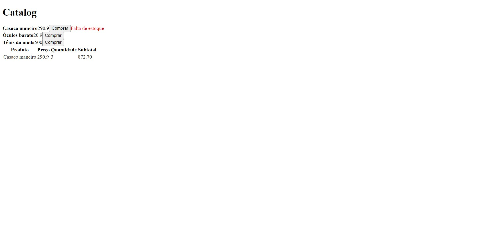

<div align="center">
  
</div>

# <div align="center"> Redux exemplo </div>

#### <div align="right">- Projeto Finalizado🟢 <div>

### <div align="center"> Aplicação em Reactjs abordando conceitos sobre: </div>

#### - Reactjs
#### - Typescript
#### - Redux | Redux Saga

## <div align="center"> Sumário </div>
<!--ts-->
   - [Requisitos](#<div-align="center">Requisitos</div>)
   - [Tecnologias utilizadas](#<div-align="center">Tecnologias-utilizadas</div>)

<!--te-->
## <div align="center">Requisitos</div>
Para executar a aplicação é necessário instalar algumas ferramentas tais como um editor de códigos para realizar compilação dos mesmos. Nesse projeto foi utilizado o [Visual Studio Code](https://code.visualstudio.com/), [NodeJS](https://nodejs.org/en/) para compilação do código, [Git Bash](https://gitforwindows.org/) para baixar o repositório e baixar todas as dependências necessárias.

```bash
# Baixe o repositório.
$ git clone https://github.com/Ricnaga/redux-example.git
# Acesse a pasta do projeto.
$ cd redux-example

# Agora que baixou e acessou o repositório, vamos começar a instalação das dependências.
$ yarn ( caso não utilize o yarn execute apenas npm -i)

# Depois de instalado todas as dependências, abra a aplicação via vscode
$ code .

# Agore execute a aplicação do backend mock.
$ yarn server (caso não utilize o yarn: npm run server)

# Seguidamente execute a aplicação do frontend.
$ yarn start (caso não utilize o yarn: npm run start)

# A aplicação iniciará na porta 3000
# No navegador caso não iniciar automaticamente, digite: http://localhost:3000
```

##  <div align="center">Tecnologias utilizadas</div>
- [Reactjs](https://reactjs.org/)
- [Redux](https://redux.js.org/)


<div align="center">Desenvolvedor:

<a href="https://www.linkedin.com/in/ricardo-nagatomy"></a>

Gostou? tem alguma sugestão de melhoria? por favor, entre em contato e ja aproveita e me adiciona.<br>

#
<div align="center">  </div>
